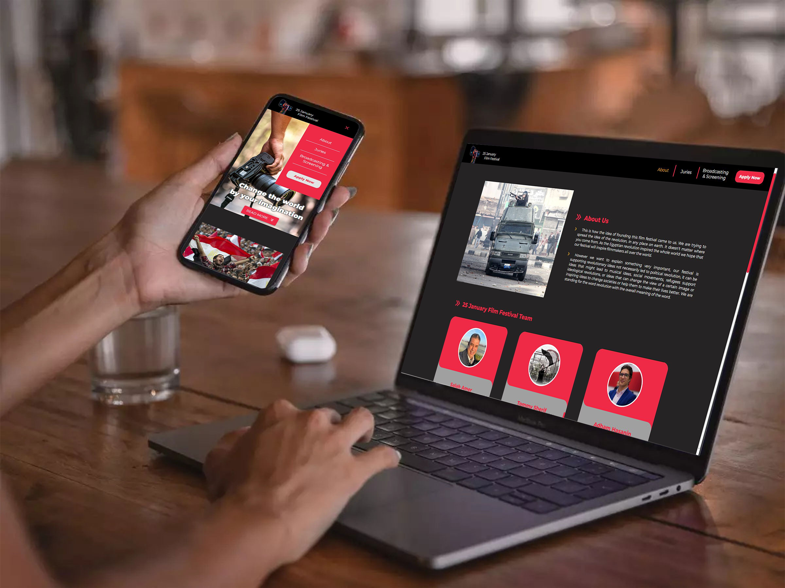
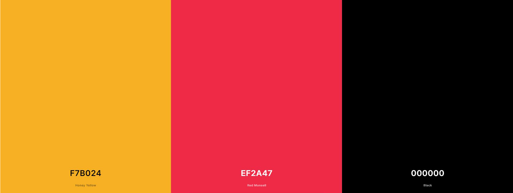

# 25 January Film Festival

## 1. Description

This program was built entirely as a voluntary work for a charitable organization that contributes to the assistance of photographers and encourages them to contribute to documenting revolutions in countries that witnessed revolutions.

## 2. Usage

- User can read the requirement to apply for this event.
- User can take a look at the juries and teams of this event.
- Easily to apply.
- Simple and Responsive UI styling for all devices.

## 3. Link and Preview


Project link is available at [25 January Film Festival](https://25januaryfilmfestival.nl/) </br>
We are using this website style [Noordelijk Film Festival](https://noordelijkfilmfestival.nl/)

### Color guide



## 5. Built with


## 6. Code structure

```
public
  └── Images
  └── index.html
src
  └── components
      └── about-data
      └── buttons
      └── card
      └── footer
      └── juries-data
      └── navbar
  └── router
      └── about
      └── awards-and-conditions
      └── broadcasting-and-screening
      └── home
      └── juries
      └── Non-found
      └── submitting
      └── team
  └── theme
  └── App.jsx
  └── index.css
  └── index.js
README.md
```